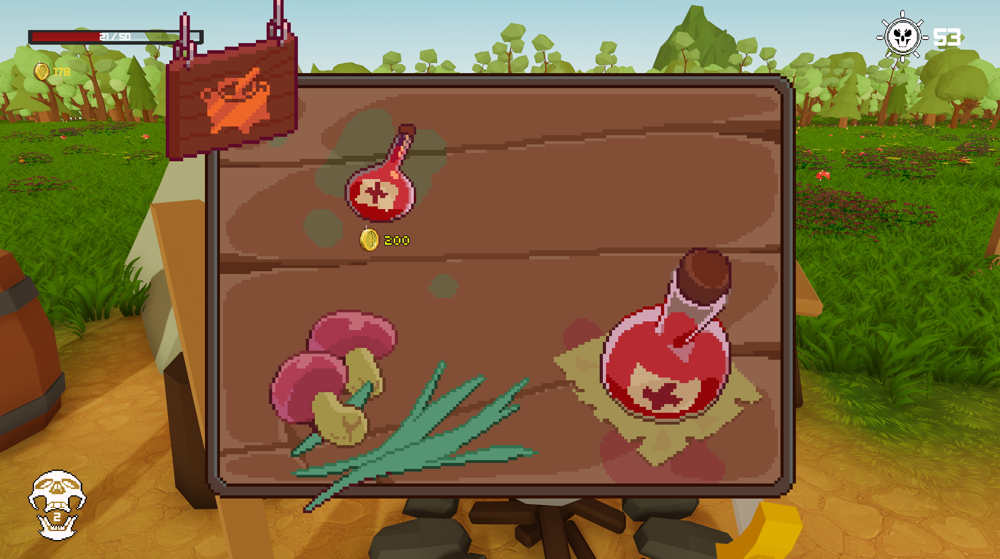

# Heart of the Forest

  

Heart of the Forest is a first-person, wave-survival game in which the player must defend a magnificent yet fragile 
crystal located at the centre of a forest encampment. 

During the day, the player must use what resources are available tothem, upgrading their weapons and armour, 
maintaining a hefty stock of potions, and repairing structural damages in the hopes of staying alive. 

During the night, the player will be faced with a variety of deadly creatures including gigantic skeletons, 
blood sucking bats, and armies of the undead.

Made in the Unity game engine.  
Submitted as an assignment project at Bournemouth University (2022).  

You can try Heart of the Forest out for yourself - [here.](https://cyanryan50.itch.io/heart-of-the-forest)  

# Current Video Demonstration
[Heart of the Forest: Project Submission Video Demo](https://drive.google.com/file/d/1cS5PLPmu78GSvz7v1XxaalXC_OpLmfPT/view?usp=drive_link)  
